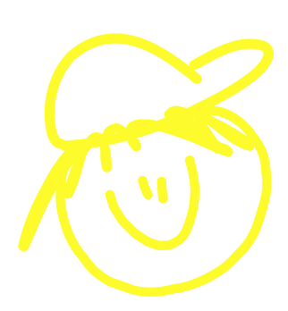
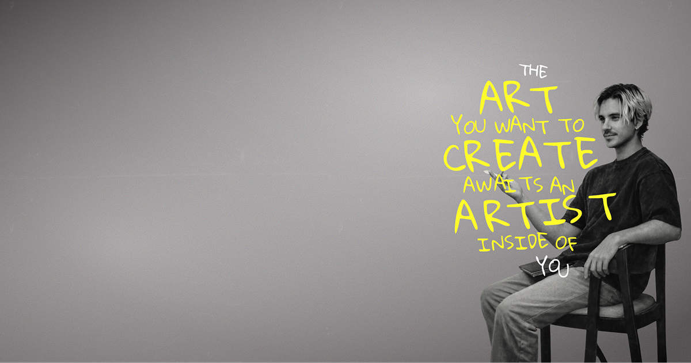

  

  <h1>LUKA DUŠAK</h1>

  
senior frontend engineer &#x2734;&#xFE0E; creative developer & designer

  
<i>be the creative you</i>

  

    <a href="https://lukadusak.com">portfolio</a> ⌁
    <a href="https://dribbble.com/lukadusak">dribbble</a> ⌁
    <a href="https://linkedin.com/in/lukadusak">linkedin</a> ⌁
    <a href="mailto:hi@lukadusak.com?subject=%5BGitHub%5D%20Let's%20create%20together&body=hey%20luka,%0D%0A%0D%0Ai%20found%20you%20through%20your%20github%20and%20would%20love%20to%20connect.%0D%0A%0D%0AProject%20brief%0D%0A-%20inquiry%20type:%20new%20project%20/%20collaboration%20/%20consulting%20/%20other%0D%0A-%20company%20/%20brand:%0D%0A-%20website:%0D%0A-%20what%20you%20need:%0D%0A-%20timeline:%0D%0A-%20budget%20range:%0D%0A-%20references:%0D%0A%0D%0AContact%20details%0D%0A-%20name:%0D%0A-%20email:%0D%0A-%20timezone:%0D%0A%0D%0A~~%20%E2%9C%8E%20~~">email</a>
  

---

_hey, im luka_

_officially a senior frontend engineer, from recently_  
_but id rather consider myself a creative, or at least like to think that way_

_built lots of stuff_  
_from mvp products and ai startups, to big-corpo projects_  
_during that time always obsessed with clean code, scalable systems, frontend architecture_  
_overthinking all the little things_

_used pretty much every tool out there, not gonna list all of them_  
_but this i consider my main stack_  
_`next.js` ✎ `typescript` ✎ `shadcn` ✎ `supabase` ✎ `drizzle` ✎ `neon` ✎ `better-auth` ✎ `stripe` ✎ `vercel`_

_and on the creative side, i love_  
_`figma` ✎ `gsap` ✎ `framer` ✎ `webflow` ✎ `photoshop` ✎ `davinci resolve`_

_of course, lots of tools help me during the process_  
_but here is my current baseline_  
_`macbook` ✎ `windsurf` ✎ `codex` ✎ `chatgpt` ✎ `notion` ✎ `warp` ✎ `brave` ✎ `spotify`_

---

_anyway, if you would like to create together or just say hi - reach out to me at ✧ [hi@lukadusak.com](mailto:hi@lukadusak.com?subject=%5BGitHub%5D%20Let's%20create%20together&body=hey%20luka,%0D%0A%0D%0Ai%20found%20you%20through%20your%20github%20and%20would%20love%20to%20connect.%0D%0A%0D%0AProject%20brief%0D%0A-%20inquiry%20type:%20new%20project%20/%20collaboration%20/%20consulting%20/%20other%0D%0A-%20company%20/%20brand:%0D%0A-%20website:%0D%0A-%20what%20you%20need:%0D%0A-%20timeline:%0D%0A-%20budget%20range:%0D%0A-%20references:%0D%0A%0D%0AContact%20details%0D%0A-%20name:%0D%0A-%20email:%0D%0A-%20timezone:%0D%0A%0D%0A~~%20%E2%9C%8E%20~~)_  
_or follow me on my socials_  
_[dribbble](https://dribbble.com/lukadusak) ✧ [github](https://github.com/im-luka) ✧ [linkedin](https://www.linkedin.com/in/lukadusak) ✧ [instagram](https://www.instagram.com/dusak.luka) ✧ [strava](https://www.strava.com/athletes/124943056)_

_and lastly, my portfolio: [lukadusak.com](https://lukadusak.com)_

> _we always try to reach for the big things. forget about the small ones - those that matter the most_  
> _exactly that, that small place, is where i love to spend most of my days_

---

†

